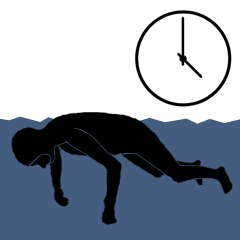

# Apnea Static Timer

A program for Garmin watches. The “Apnea-Static-Timer" is a simple timer and stopwatch for training apnea statics. It is written in “Monkey C" a language specially developed for Garmin watches.

This project is a fork of the [original application from Max Stransky](https://gitlab.com/ApnoeMax/apnoe-statik-timer).

## Installation of development environment

### install SDK manager

    https://developer.garmin.com/connect-iq/sdk/

#### install the SDK

This application uses SDK version 4.0.6. It is not yet compatible with higher versions of the SDK.

#### install the watches

You will need the following watches installed

- descentmk1
- descentmk2
- descentmk2s
- fenix5 (for the font)

### install the Java runtime

    https://www.java.com/en/download/

### install Visual Studio Code

    https://code.visualstudio.com/

#### install the VSCode Monkey C extension

- After Visual Studio Code restarts, summon the command palette with Ctrl + Shift + P (Command + Shift + P on Mac).
- Type "Verify Installation" and select Monkey C: Verify Installation
